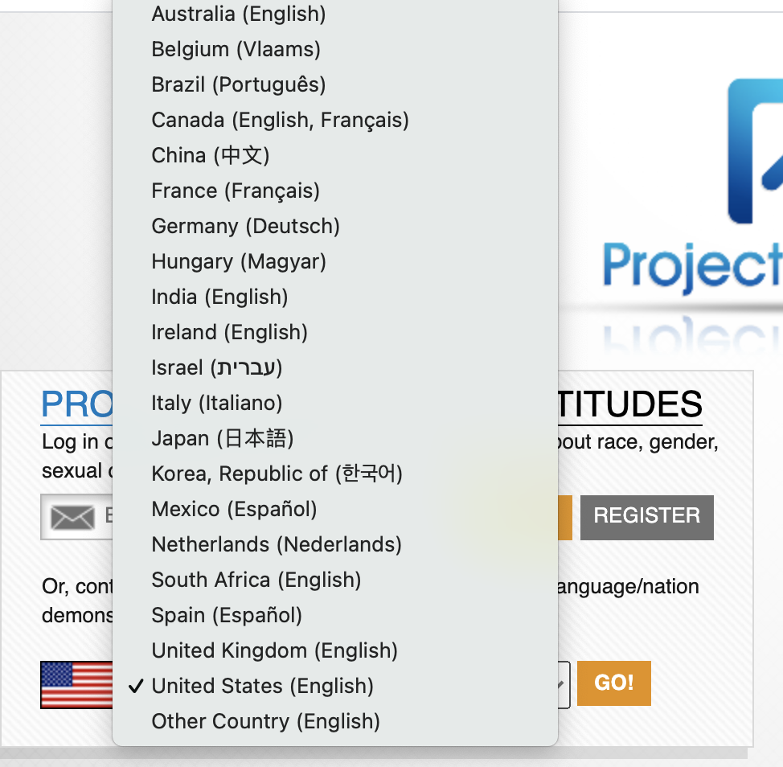
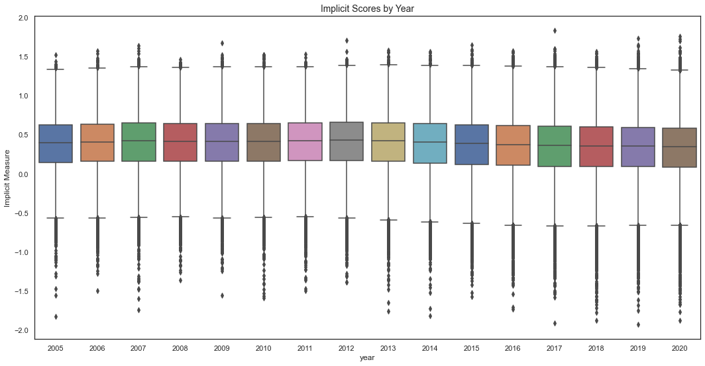

# Implicit Bias Correlations
Capstone Project #1 for RPP2 Cohort of Galvanize Data Science Immersive Program - Correlations Between Types of Bias &amp; Changes Over Time

## Background and Motivation
The Implicit Association Test (IAT) from Harvard's Project Implicit captured my imagination when I read about it years ago in Shankar Vedantam's book, [Hidden Brain](https://www.amazon.com/Hidden-Brain-Unconscious-Presidents-Control/dp/0385525222). He speaks of it frequently in his podcast of the same name. I first took one of the tests about ten years ago and was surprised enough by my result to want to dive into the information further. There have been many papers written and studies performed using these publicly available data, all ranging in conclusions about the implications and urgencies suggested by the outcomes of these tests. While I do not believe that the binary categories presented in the test in any way represent the complexities of our intersectionality as humans, I am curious about the suggestion that our unconcious bias might be measured in some way. For this reason, I decided to explore the changes in the outcomes of these tests over time, from 2006 to 2020. Because I am still learning, most of my time was spent cleaning one test dataset, described below. 

From [their website](implicit.harvard.edu): 
"Project Implicit is a non-profit organization and international collaboration between researchers who are interested in implicit social cognition - thoughts and feelings outside of conscious awareness and control. The goal of the organization is to educate the public about hidden biases and to provide a “virtual laboratory” for collecting data on the Internet."

There are currently 14 tests on the website available in multiple languages. For the purpose of this project, the data described within comes solely from the Gender-Career IAT. 

## Data 
Data was downloaded from [Project Implicit's Demo Website](https://osf.io/y9hiq/), through .sav (SPSS) files saved alongside excel codebooks detailing the data. 

**Table 1: Data Overview**
| Descriptor | Detail | Notes |
|---|---|---|
| Total n in Dataset | 3,159,286 | 192 columns |
| Total n in Cleaned Dataset | 1,016,675 | 14 columns |
| Dependent Variable | Implicit Score | Range: -2 to 2 <br>(description below) |
| Other Features | * Year of Test <br> * Explicit Score <br>  * Education Level <br> * Political Affiliation <br> * Religiosity <br> |

------------

### Cleaning the Data, Step by Step: 

* Loaded .sav files into pandas dataframes & concatenated all 16 years of data (Starting n = 3,159,286) 
*  Cleaned data to delete incomplete sessions or those missing key attitudes / variables for this specific project
    * Completed Tests = 1,627,738 (51.52% completion rate)
    * Acceptable Error Rate: 
        * Per other studies from researchers (specifically following steps in cleaning scripts used for [this study from 2007-2015](https://osf.io/k9vqc/)), identified and removed participants with high rates of error (more than 30% or more than 10% of trials were 'too fast'), using their criteria. 
        * Completed Tests with Acceptable number of errors = 1,442,692
    * Recode necessary variables with descriptive names where necessary & numeric response where possible: 
        * Education: 
            * Highest Education Completed scale changed from 13 items to 14 somewhere along the way so I kept the 13 and put the added 14th ("MBA") back into 'other advanced degree' as it was in years prior. 
            * There were 11,083 data points collected with the 14th category, those were absorbed back into the edu_13 column; removed 'edu' column with redundant values. 
        * Religion: 
            * Combined religion columns with different indicators; kept religious id as most relevant (not religious, a little religious, etc... instead of having specific denominations)
        * 

post saturday session: 
- Wasted morning trying to use plotly, abandoned at noon 
- Got some good plots from what I thought was clean data but then I saw a big dip in 2016 participation and am concerned about that
- Also idea to demonstrate unchanging or stagnant or changing demographics among this population of people who take the test (seems always 70% female, does that carry for other tests or just the gender ones?, and also other parameters). 


Loading Data: 
1. Project Implicit zip file download.
2. Unzip & Move files to appropriate folder (data / codebooks).
3. Import with `pd.read_spss`.
4. [Once I had the data loaded all I really did was waste some time cleaning in twenty different ways to make sure I'd done it right without really following my pre-defined workflow at all... ]
5. Clean data (see below) 
6. Imports for Jup Ntbk: 
```
    import pandas as pd
    import numpy as np
    import matplotlib.pyplot as plt
    import pyreadstat
    import glob
    import seaborn as sns
    %matplotlib inline
```

Cleaning Specific Sections: 
1. Create a renamed csv with most recent df to save work. 
2. Make a copy of old df to save work. 
    * `new_df = old_df.copy()`    
3. Compare all columns with data for this section. 
    * `df.col_name_1.count(), df.col_name_1.unique(), len(df.col_name_1.unique())`
4. Create csv to visually compare columns. 
    * `df[['col_name_1', 'col_name_2', 'etc']].to_csv('folder/csvname.csv')`
5. Create a dictionary for any value replacements before merging. 
    * `col_dict = {'bye': 'hello'}`
    * Note to self: **Always include np.nan : 'Not Reported' in each section dictionary!!!**
6. Choose a main column & fill it with vals from other columns. 
    * `df.main_col.replace(to_replace=df_dict, inplace=True)`
    * Repeat for number of columns in section (could probably make a function for this? But they're all so different...)
    * Visual check with new csv
7. Drop unnecessary columns 
    * `df.drop(columns=['col_1', 'col_2'], inplace=True, axis=1)`
8. Wrap it up
    * Create csv with df
    * Create copy of df for new section, rename. 


Gender-Career Test Offered in 14 languages: 



| Max Implicit Measure | Min Implicit Measure | Mean Implicit Measure | 
| ----------| ---------|--------| 
| 1.83 | -1.87 | 0.36 |


EDA: 


 

## Future Work 
* 